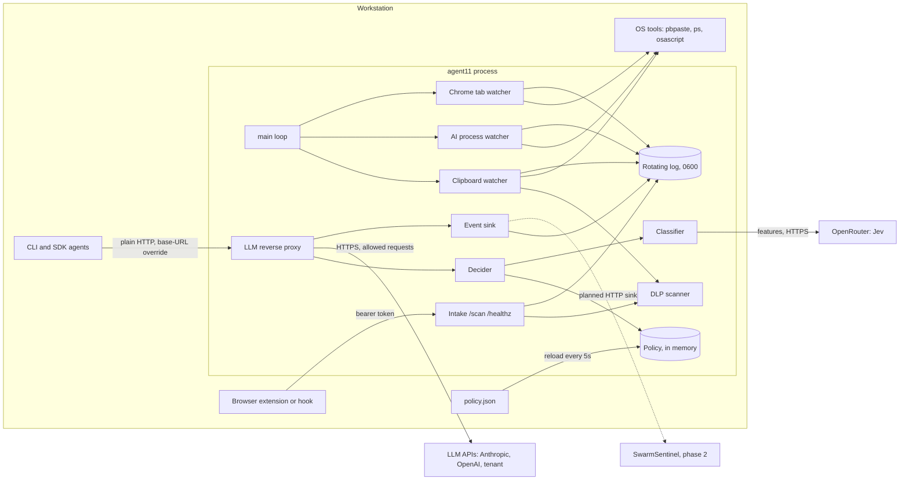
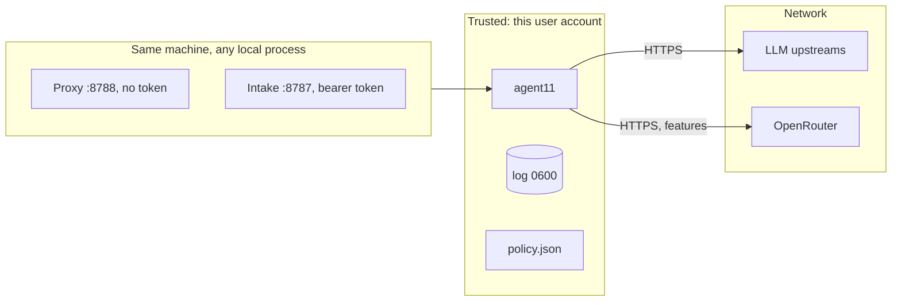

# agent11 Architecture and Design

As of 2026-10-09. Matches the code at phase 1. CLAUDE.md holds the working rules; this file explains the design and the reasons behind it.

agent11 is a single Go binary on each workstation that keeps company data from leaking to LLMs. It senses AI use on the machine, and decides and enforces on requests that agents route through its loopback proxy. It stores a local log and a body-free metrics database, never the content it judged.

## Scope

agent11 protects whatever the company defines as a class: source code, product plans, customer data, credentials, legal material. Classes live in a policy file, so adding one is a data change, not a code change.

| Job | What it does | Status |
| --- | --- | --- |
| Sense | Watch the clipboard, running AI apps, and AI sites open in Chrome; scan text for secrets and PII | Built |
| Decide | Classify an outgoing LLM request against the policy and produce a verdict | Built (phase 1) |
| Enforce | Block requests whose class is in enforce mode | Built, report mode by default |
| Report to SwarmSentinel | Send each decision to the policy engine and flight recorder | Planned (phase 2), local log sink today |
| Translate | Replace sensitive values with surrogates | Interface stub only |

Out of scope: storing prompts or responses, TLS interception, system-wide traffic capture, replacing an egress gateway or MDM agent, and judging what is legally privileged. A local tool stops accidents, not deliberate exfiltration from another device.

## Architecture



| Component | File | Responsibility |
| --- | --- | --- |
| Main loop | `main.go` | Flags, startup checks, polling tickers, policy reload, shutdown |
| Clipboard watcher | `main.go` | Polls the OS clipboard every 500 ms; logs changes with DLP findings |
| Clipboard guard | `guard.go` | Optional: replaces a sensitive clipboard with a notice |
| AI process watcher | `procwatch.go` | Scans the process list every 5 s; logs AI apps starting and stopping |
| Chrome tab watcher | `browserwatch.go` | Reads Chrome tab URLs via AppleScript (macOS); logs AI site hosts only |
| DLP scanner | `dlp.go` | Built-in secret and PII patterns plus user keywords; returns rule names and counts |
| Intake | `intake.go` | Loopback HTTP endpoint for other tools to submit text for a DLP scan |
| Policy | `policy.go` | Loads, validates, and compiles the JSON policy |
| Decider | `decide.go` | The decision pipeline; produces a content-free `Decision` |
| Classifier | `classify.go` | Interface; no-op default; Jev client over OpenRouter |
| LLM proxy | `proxy.go` | Loopback reverse proxy; decides, then blocks or forwards |
| Event sink | `events.go` | `Sink` interface; logfmt sink to the rotating log |
| Translator | `translate.go` | Interface stub for surrogate values |
| Eval | `eval.go` | Scores the pipeline against a labeled corpus |
| Rotating log | `rotate.go` | Size and line based rotation with numbered backups |
| Metrics store | `metrics.go`, `metrics_query.go` | Local SQLite of body-free events; `agent11 metrics` CLI |
| Agent lifecycle | `lifecycle.go`, `lifecycle_query.go` | `agent11 hook` for Claude Code hooks, hook socket, lifecycle fold, launch and resource metrics |
| Dashboard | `dashboard.go`, `dashboard_html.go` | `agent11 dashboard`: loopback web view of the metrics database (phase 2) |

## Request flow

```mermaid
sequenceDiagram
  participant Agent
  participant Proxy as agent11 proxy
  participant Decider
  participant Clf as Classifier (Jev)
  participant Log as Rotating log
  participant Up as LLM API

  Agent->>Proxy: POST /api.anthropic.com/v1/messages
  Proxy->>Proxy: validate host, read body (cap 32 MB)
  Proxy->>Decider: text, labels, agent ID, host
  Decider->>Decider: destination category from policy
  Decider->>Decider: labels, path globs, fingerprints, keywords, rules (all classes)
  alt verdict could still get stricter and a classifier is set
    Decider->>Clf: features only (or raw if the class opted in)
    Clf-->>Decider: probability per class, or error/timeout
  end
  Decider-->>Proxy: Decision (no content)
  Proxy->>Log: event: verdict, classes, rules, mode
  alt enforced and verdict is not allow
    Proxy-->>Agent: 403 error JSON naming classes and owners
  else report mode or allow
    Proxy->>Up: HTTPS, same path, headers minus X-Agent11-*
    Up-->>Proxy: response (streamed; usage token counts read in flight)
    Proxy-->>Agent: response, flushed as it arrives
  end
```

The decision pipeline:

1. Map the destination host to a category (`approved-tenant`, `consumer-chat`, `public-api`). A host not in the policy is `unlisted` and gets each class's strictest action.
2. For every class, check the deterministic detectors: source labels from `X-Agent11-Labels`, path globs against paths found in the text, SHA-256 fingerprints of the whole text and of each line of 20 bytes or more, keywords, and rules.
3. Take each matched class's action for the category. The strictest becomes the verdict so far.
4. Call the classifier only for enabled classes with no deterministic hit whose action here is stricter than the verdict so far. A deterministic `block` skips it.
5. A probability at or over `block_at` takes the class's action. One at or over `hold_at` takes the softer of the action and `hold`.
6. Mode: a class's own mode wins, then `-mode`, then the policy's global mode. Only enforce-mode classes contribute to the applied verdict.

Verdicts are ordered `allow < translate < hold < block`. In phase 1 the proxy treats applied `hold` and `translate` as `block`, with a message saying why.

## Endpoints

### Inbound

Both servers bind to loopback only and refuse to start on any other address.

| Endpoint | Server, flag | Method | Auth | Request | Response |
| --- | --- | --- | --- | --- | --- |
| `/<upstream-host>/<path>` | Proxy, `-proxy 127.0.0.1:8788` | Any | None of its own; the agent's API key passes through to the upstream | The provider's own request; optional `X-Agent11-Labels`, `X-Agent11-Agent` | Upstream response, streamed; or an agent11 error JSON |
| `/scan` | Intake, `-listen 127.0.0.1:8787` | POST | `Authorization: Bearer <token>` or `X-Agent11-Token` | `{"source","site","text"}`, at most 4 MiB | `{"flagged":bool,"findings":[{"rule","count"}]}` |
| `/healthz` | Intake | Any | None | None | 200, empty |

Agents reach the proxy with a base-URL override whose first path segment is the upstream host:

```bash
ANTHROPIC_BASE_URL=http://127.0.0.1:8788/api.anthropic.com
OPENAI_BASE_URL=http://127.0.0.1:8788/api.openai.com/v1
```

Proxy status codes:

| Status | `error.type` | When |
| --- | --- | --- |
| 403 | `permission_error` | Request blocked by policy; message names classes and owners |
| 403 | `permission_error` | Upstream host is loopback |
| 404 | `not_found_error` | First path segment is not a valid host |
| 413 | `request_too_large` | Body over `-proxy-max-mb` (default 32) |
| 400 | `invalid_request_error` | Body could not be read |
| 502 | `api_error` | Upstream connection failed |
| other | upstream's own | Anything the upstream returns passes through unchanged |

Error bodies have the shape `{"type":"error","error":{"type":"...","message":"..."}}`, which both the Anthropic and OpenAI SDKs parse.

Intake status codes: 405 for a non-POST to `/scan`, 401 for a missing or wrong token, 400 for bad JSON or an oversized body.

### Outbound

| Destination | Protocol | When | What is sent | Timeouts |
| --- | --- | --- | --- | --- |
| LLM upstream (host from the path) | HTTPS | Each allowed or report-mode request | The original request, minus `X-Agent11-*` headers | None on the stream; Go defaults for connect |
| OpenRouter `POST /api/v1/systemone` | HTTPS, `Bearer $OPENROUTER_API_KEY` | `-classifier jev` and an ambiguous request | Model ID, a `state` of features (or raw text for opted-in classes), one `noul` question per class | `-classifier-timeout` (2 s) for the whole call, one retry |
| SwarmSentinel | HTTP | Phase 2 | Decision events, no content | Not built |

### Metrics CLI

| Command | Opens the database | Output |
| --- | --- | --- |
| `agent11 metrics query [--json] [--from] [--to] [--class] [--dest] [--category] [--agent]` | Read-only, `query_only` | Text report, or JSON with `schema_version`, `units`, `window`, `coverage` |
| `agent11 metrics export [--from] [--to] [--output path]` | Read-only | Body-free NDJSON in event order; output file created 0600 |
| `agent11 metrics clear --yes` | Read-write | Deletes all rows and vacuums |
| `agent11 hook [Event] [--socket path]` | None; posts to the hook socket | Nothing on stdout; always exits 0 |
| `agent11 hook --print-config [agent]` | None | That agent's hooks config fragment (default claude-code; also antigravity) |

Query also takes `--agent-kind`, `--model`, and `--stall-ms`.

### Dashboard (phase 2)

`agent11 dashboard [--db path] [--listen 127.0.0.1:9090] [--stall-ms ms]` serves a read-only web view of the metrics database. The collector also serves it in-process on `127.0.0.1:9090` by default (`-dashboard ""` turns that off), reading the same database read-only, which WAL mode allows alongside the writer. The standalone command needs no running agent11. It binds to loopback only and refuses any other address.

| Endpoint | Returns |
| --- | --- |
| `GET /` | A self-contained HTML page (inline CSS and vanilla JS, no external resources; its own Content-Security-Policy forbids them) |
| `GET /api/metrics?from=&to=&agent=&agent_kind=&model=&category=` | The full `metricsReport` as JSON |
| `GET /api/timeline?from=&to=&buckets=` | Per-bucket counts of events, decisions, blocked, sensitive copies, and agent turns |
| `GET /healthz` | 200 |

`from` and `to` take epoch ms, RFC 3339, or a duration back from now (`24h`, `7d`); the default window is 24 hours. The page shows summary tiles, an activity-over-time chart, an inventory of agents and AI tools on the machine (running-now status, active time, peak CPU and memory, process count), agent activity (time in state, turns, operator waits, stalls, sessions by model and kind), data-protection decisions (by verdict, class, and rule), clipboard and intake, destinations and models, and agent11's own overhead. It shows counts, labels, and timings only, because the store holds no content.

### Hook socket

| Endpoint | Transport | Auth | Request | Response |
| --- | --- | --- | --- | --- |
| `POST /hook` | Unix socket, 0600, in a 0700 directory | File permissions: only this user can connect | `{"kind","agent_kind","session_id","turn_id","request_id","tool_class","model","at_ms"}`, at most 4 KiB; every field re-validated | 204, or 400 naming the bad field |

`--from` and `--to` take epoch milliseconds, RFC 3339, or a duration back from now (`24h`, `7d`). The default window is the last 24 hours.

### Local commands

| Command | Platform | Used by | Interval |
| --- | --- | --- | --- |
| `pbpaste`, PowerShell `Get-Clipboard`, `wl-paste` / `xclip` / `xsel` | macOS, Windows, Linux | Clipboard watcher | 500 ms |
| `ps -A` (twice), `tasklist` | Unix, Windows | AI process watcher | 5 s |
| `osascript` | macOS | Chrome tab watcher | 5 s |
| `pbcopy`, PowerShell `Set-Clipboard`, `wl-copy` / `xclip` / `xsel` | macOS, Windows, Linux | Clipboard guard | On a guarded copy |

Each runs under a 3 second timeout so a hung tool cannot stall the loop.

### Flags

| Flag | Default | Purpose |
| --- | --- | --- |
| `-policy` | none | Policy file; required by `-proxy` and `-eval` |
| `-proxy` | off | Proxy listen address |
| `-proxy-max-mb` | 32 | Body cap for scanning and forwarding |
| `-mode` | policy's | `report` or `enforce`; per-class mode still wins |
| `-classifier` | `none` | `none` or `jev` |
| `-classifier-model` | `typesafe/jev-1.13` | Pinned model ID |
| `-classifier-timeout` | 2s | Bound on classifier time per request |
| `-eval` | off | Score a corpus directory, print, exit |
| `-listen`, `-intake-token` | off, generated | Intake endpoint and its token |
| `-log`, `-max-mb`, `-max-lines`, `-max-backups` | `agent11.log`, 10, 10000, 5 | Log location and rotation |
| `-log-content` | true | Whether clipboard and intake text is written to the log |
| `-dlp-keywords` | none | Extra confidential markers for the DLP scanner |
| `-clipboard-guard` | `off` | `off`, `ai` (while an AI site in Chrome or a desktop AI app is open), or `always` |
| `-guard-rules` | all built-in rules but `email`, plus `keyword:*` | Findings that trigger the guard |
| `-interval`, `-ai-interval`, `-browser` | 500ms, 5s, true | Watcher cadence |
| `-metrics`, `-metrics-db` | true, `<user config dir>/agent11/metrics.sqlite3` | Metrics store on or off, and its path |
| `-metrics-retention`, `-metrics-max-mb` | 336h, 256 | Retention window and size cap |
| `-hooks`, `-hook-socket` | true, `<user config dir>/agent11/hooks.sock` | Accept lifecycle events from `agent11 hook` |
| `-dashboard` | `127.0.0.1:9090` | Serve the dashboard in-process (empty = off; needs `-metrics`) |
| `-quiet`, `-once` | false | Console output; print clipboard and exit |

## Data storage

agent11 keeps two local stores: the rotating log and a SQLite metrics database. Neither leaves the machine.

| Data | Where | Lifetime | Contains content? |
| --- | --- | --- | --- |
| Rotating log `agent11.log` | Local file, mode 0600 | Rotates at 10 MB or 10,000 lines; keeps `.1` to `.5`, then deletes | Clipboard and intake text **yes, while `-log-content=true` (the default)**. Proxy decisions, process and tab events: no |
| Policy | `policy.json` on disk, read only; compiled copy in memory | Reloaded when its mtime changes, checked every 5 s | Class definitions and short examples; must hold no real secrets |
| Request body | Process memory | One request; dropped after forwarding | Yes, briefly; never written to disk or log |
| Metrics database `metrics.sqlite3` (+ `-wal`, `-shm`) | `<user config dir>/agent11/`, file 0600, dir 0700 | 14 days (`-metrics-retention`), pruned hourly in batches; capped at 256 MB (`-metrics-max-mb`) | No: kinds, labels, counts, timings only |
| Last clipboard value | Process memory | Until the next change | Yes |
| Guarded clipboard text | Nowhere: replaced by a notice; the log gets rule names and byte count only, even with `-log-content=true` | None | No |
| Running-app and open-site sets | Process memory | Until the next scan | App names and site hosts |
| Intake token | Flag, or generated and printed to stderr | Process lifetime | Never written to the log |
| Eval corpus | `testdata/corpus/` in the repo | Versioned | Synthetic samples only |

What a decision event holds: timestamp, verdict, applied verdict, enforced flag, mode, destination host and category, classifier status, matched class IDs, detector names (`keyword`, `rule:aws-access-key`, `label:repo:core`), confidence, agent ID and `agent_id_source=declared`. It never holds request text, matched values, prompts, responses, or headers.

### Metrics schema (version 3, `PRAGMA user_version`)

Modeled on c11's journal store: WAL mode, incremental auto-vacuum, a versioned schema that refuses unknown versions, batched writes off the request path.

| Table | Columns | Purpose |
| --- | --- | --- |
| `events` | `seq`, `at_ms`, `kind`, `verdict`, `applied`, `enforced`, `mode`, `dest`, `category`, `agent_id`, `agent_id_source`, `app`, `classifier`, `bytes`, `latency_us`, `confidence`; version 2 adds `session_id`, `agent_kind`, `model`, `provider`, `turn_id`, `request_id`, `tool_class`, `cpu_pct`, `cpu_max`, `rss_kb`, `procs`; version 3 adds `input_tokens`, `output_tokens` | One row per event; unused columns are NULL. A version 1 database is upgraded in place |
| `event_labels` | `seq` (cascade delete), `label_kind` (`class` or `rule`), `value`, `count` | Classes and rules per event, for grouping |
| `meta` | `key`, `value` | `dropped_events`, `created_at_ms` |

Event kinds: `agent_started`, `agent_stopped`, `decision`, `clipboard`, `clipboard_guarded`, `intake`, `ai_app_started`, `ai_app_stopped`, `ai_site_opened`, `ai_site_closed`, `policy_reload`, `resource_sample`, `token_usage`, and the agent lifecycle kinds `agent_session_started`, `agent_session_ended`, `agent_turn_started`, `agent_turn_completed`, `agent_question_requested`, `agent_plan_review_requested`, `agent_approval_requested`, `agent_attention_resolved`, `agent_tool_activity`, `agent_error`, `agent_child_spawned`, `agent_child_completed`, `agent_observation`.

### Agent lifecycle metrics (phase 1.1, after c11)

An agent runs `agent11 hook [--agent <kind>] <Event>` for each hook; `agent11 hook --print-config [claude-code|antigravity]` prints the config fragment. The command maps that agent's payload (Claude Code as c11's `ClaudeHookMapping` does; Antigravity from its `conversationId`, `toolCall`, `modelName` payload) and sends only the event name, opaque session/prompt/tool-use IDs, a tool class (`ask_user_question`, `exit_plan_mode`, `other`), and the model, over the hook socket. The two built-in agents are hand-written Go; every other agent is added declaratively by dropping a `<name>.json` adapter in the adapters directory (`~/.config/agent11/adapters/` by default, or `--adapters <dir>`), with no recompile. See `adapters.go` and `docs/adapters/example.json`. `agent11 hook --list-agents` lists built-in and custom agents.

Antigravity differs from Claude Code in two ways: it has no session start/end event, so a session is keyed on `conversationId` and first-seen marks it (its sessions appear under `seen`, not `started`); and it signals waiting-on-the-operator through the hook's own `decision` output rather than an event, so operator-wait timing is not available in observe-only mode. `agent11 metrics query` folds them per session:

| Metric | How it is measured |
| --- | --- |
| `agents.time_in_state_ms` | Time per phase: `working` (UserPromptSubmit to Stop), `blocked`, `idle`, `error` (StopFailure), `unknown` (a session first seen mid-flight) |
| `agents.blocked_ms` | Blocked time by reason: `approval` (permission prompt), `question` (AskUserQuestion), `plan_review` (ExitPlanMode) |
| `agents.turns` | Started, completed, ambiguous (a new prompt with no Stop for the last turn, which is what an interrupt looks like), per covered hour |
| `agents.operator_response` | Wait from a block to its answer: a question or plan review ends at its own PostToolUse; an approval ends at the next tool activity or Stop, so it includes the approved tool's run time; a new prompt answers anything pending. Count, total, average, p50, p95, by reason, censored. `resume_ms` stays null: c11 times the operator's keypress, which agent11 cannot see |
| `agents.errors` | Session failures (StopFailure), subagents spawned and completed |
| `agents.stalls` | A working session with no hook evidence for `--stall-ms` (default 15 minutes): start, duration, ongoing |
| `launches` | Sessions by agent kind and model (SessionStart), AI app launches (apps already running when agent11 starts are not launches), proxy requests by model (request `model` field) and provider (from the host) |
| `resources` | Per AI app and agent11 itself: samples (one a minute), average and peak %CPU as `ps` reports it, average and peak resident memory, peak process count. Windows reports memory only |
| `tokens` | LLM token usage read from proxied responses: input, output, and total, by model and provider. Proxied requests only; other channels have no token data |

When agent11 stops, open intervals end then; after a crash they end at the last event recorded before the restart and are counted as censored, as AI usage is.

`agent11 metrics query` reports, for a window `[from, to)`: decisions by verdict, category, destination, agent, class (decisions, blocked, flagged in report mode), and rule; classifier status counts; decision latency p50, p95, p99, max; clipboard copies, sensitive copies, guarded copies by rule; intake scans; AI app and site sessions and active time; policy reloads; and coverage (retained range, dropped events, whether the window predates the oldest row). AI usage is rebuilt from start and stop events; an interval left open by a crash ends at the last event before the restart and is counted as censored.

Open item: `-log-content` defaults to true, so the log keeps clipboard text unless the operator turns it off. For a fleet rollout the default should likely flip to false. This is an owner decision.

## Access and trust boundaries



| Boundary | Control | Residual risk |
| --- | --- | --- |
| Network to agent11 | Proxy and intake bind to loopback only; non-loopback addresses refused at startup | None from the network |
| Local process to intake | Bearer token, constant-time compare; 4 MiB cap; header, read, and write timeouts | A process that can read agent11's stderr or flags can learn the token |
| Local process to proxy | No token: any local process may use it | It only forwards to hosts the caller names, as the caller could do directly; loopback upstreams are refused so it cannot reach other local services |
| Agent credentials | API keys and `Authorization` pass through untouched; headers are never logged | The proxy sees keys in memory while forwarding |
| Classifier | `OPENROUTER_API_KEY` from the environment only; features, not content, by default; raw opt-in per class is listed in the startup log; error bodies are not logged | A class with `classifier_raw: true` sends text to a third party |
| Disk | Log is 0600; policy is read only | Anyone with the user's account can read the log |
| Agent identity | `X-Agent11-Agent` is recorded as `declared`, not trusted | Any process can claim any agent ID until a trusted launcher exists (phase 3) |
| Source labels | `X-Agent11-Labels` is taken as given | A process can omit labels; labels only ever add restrictions |

## Design decisions

| # | Decision | Alternatives considered | Why |
| --- | --- | --- | --- |
| 1 | Single Go binary, standard library only | Python agent; third-party proxy and YAML libraries | One file to deploy on every OS; no supply chain to audit |
| 2 | Base-URL reverse proxy, no TLS interception | MITM proxy with a local CA; system-wide capture | No root CA to install or protect; agents opt in explicitly; works with any tool that honors a base URL |
| 3 | Upstream host as the first path segment | Per-provider prefixes such as `/anthropic`; `Host` header routing | One generic rule covers every provider with no code per provider |
| 4 | Loopback-only binding for proxy and intake | LAN listener with auth | The tool is per-workstation; nothing remote should reach it |
| 5 | Deterministic detectors decide; the classifier is advisory | Classifier first; classifier only | Hard rules cannot be talked out of a verdict by manipulated text, and they cost nothing |
| 6 | Run every deterministic step for every class, not stop at the first hit | Stop at the first step that matches anything | Stopping early lets one class's allowed hit hide a stricter class |
| 7 | Classifier sees features, not content, by default | Send raw text; self-host only | A hosted model never receives company content unless a class opts in, and the opt-in is visible |
| 8 | Report mode by default; enforcement per class | Global enforce switch | Lets a class prove its miss and false-positive rates on real traffic before it can block work |
| 9 | JSON policy, unknown fields rejected, hot reload keeps the last good policy | YAML; restart to reload | Stdlib has no YAML; a typo must fail loudly, not disable a detector; a bad edit must not open the gate |
| 10 | Unlisted destination gets each class's strictest action | Allow unlisted; refuse unlisted | Matches the policy rule and fails safe without breaking calls that match no class |
| 11 | Decisions and events carry no content | Log redacted snippets | The log and SwarmSentinel must not become a store of what they protect |
| 12 | Classifier failure: allow, unless the request carries a source label, then block | Always block; always allow | Keeps agents working when the classifier is down, while labeled data still fails closed |
| 13 | `hold` and `translate` act as `block` in phase 1 | Forward with a warning | No approval flow or translator exists yet; acting as allow would be silently unsafe |
| 14 | Oversized bodies get 413 in every mode | Forward unscanned in report mode | An unscanned forward is a blind spot; 32 MB is at or above common provider limits |
| 15 | One error body shape for Anthropic and OpenAI SDKs | Per-provider error formats | Both SDKs read `error.message` and `error.type`, so one shape surfaces the reason in either |
| 16 | Jev: one `noul` question per class per chunk; highest chunk wins; any failure fails the call | One multi-choice question; partial results | Thresholds need a probability per class; a partial answer could understate a class |
| 17 | `Sink` interface; SwarmSentinel over HTTP, no vendored code | Import SwarmSentinel as a library | The projects have different licenses; agent11 must run without SwarmSentinel present |
| 18 | Card numbers found by windows of whole digit groups, network prefix 2 to 6, Luhn | One greedy 13-19 digit regex | The greedy match swallowed a trailing expiry or CVV on the same line and missed the card |
| 19 | Clipboard guard replaces the clipboard with a notice, off by default | Block the paste; always on | A local tool cannot block a browser paste; wiping changes user data, so it is opt-in until a browser extension exists |
| 20 | Metrics in local SQLite via `modernc.org/sqlite` | `mattn/go-sqlite3` (cgo); shelling out to `sqlite3`; more logfmt | Pure Go keeps one cross-compiled binary; SQL answers windowed and grouped queries a dashboard needs; first and only dependency, approved by the owner |
| 21 | Body-free events with a label table, batched async writes | Store decisions as JSON blobs; synchronous inserts | Grouping by class or rule stays in SQL; a slow disk can drop metrics but never delays a request |
| 22 | Agent lifecycle from Claude Code hooks over a Unix socket | Read Claude transcripts; TCP with a token file | Hooks are what c11 trusts most; a 0600 socket needs no token, so no secret has to be stored for the hook command |
| 23 | Operator wait ends at the next sign of progress; no resume metric | Copy c11's keypress-based response and resume | agent11 sees no keystrokes; reporting `resume_ms` as null is honest, and approval waits are documented as including tool run time |

## Failure behavior

| Failure | Behavior |
| --- | --- |
| Policy invalid at startup | Refuse to start, naming the class and field |
| Policy invalid on reload | Keep the last good policy; log the error once |
| Classifier timeout or error | Fall back to deterministic results; block only if the request carried a source label; log `classifier=unavailable` |
| `OPENROUTER_API_KEY` missing with `-classifier jev` | Refuse to start |
| Upstream unreachable | 502 to the agent; log `upstream failed` |
| Proxy or intake cannot bind | Log the error and exit with status 1 |
| No clipboard tool | Exit at startup. Note: this also stops the proxy on a headless machine |
| Clipboard, `ps`, or `osascript` errors after startup | Log each distinct error once, keep polling |
| Log rotation error | The write fails and the error is returned to the logger |
| Metrics database cannot open (bad version, symlink, permissions) | Refuse to start; `-metrics=false` runs without it |
| Hook socket cannot start (path taken by a file, another agent11 listening) | Log the error; everything else keeps running, without lifecycle metrics |
| `agent11 hook` cannot reach agent11 | Exit 0 silently after at most 1 second; the agent never sees an error |
| Metrics writes fail or the buffer fills | Drop the events, count them in `meta.dropped_events`, log each distinct error once |
| Clipboard guard cannot write the clipboard | Log `clipboard guard failed` with the findings, then log the copy as usual |
| Paste within one poll of the copy | Not caught: the guard's known race (`-interval`, default 500 ms) |

## Roadmap and open decisions

| Phase | Scope | Gate |
| --- | --- | --- |
| 1 (built) | Policy, decider, proxy, classifier interface with Jev, file sink, eval | Proposed: miss rate under 5% per class on 200+ samples, under 2% false positives, under 100 ms added p95, two weeks of report-only data |
| 2 | Metrics dashboard over `agent11 metrics query --json`, HTTP sink to SwarmSentinel, recorder, confidentiality labels in the ASP schema, cross-agent taint, local approval flow for `hold`, a real Translator | Phase 1 gate met |
| 3 | c11 integration: trusted agent identity at panel spawn, launcher labels, sidebar status, panel suspend | Only if agent-swarm workstations are a confirmed target |

Open decisions for the owner:

- The first 3 to 5 company classes and the phase 1 exit thresholds.
- Whether the hosted classifier gets features only, surrogate text, or is replaced by a self-hosted model.
- Whether `-log-content` should default to false.
- Whether the proxy should run without the clipboard watcher, for headless hosts.
- The optional `fingerprints` field and the `rules` format added to policy schema version 1.
- SwarmSentinel event and policy fields, after reviewing its repo.
- Whether employee monitoring needs HR and counsel review before rollout. In California, employee data falls under the CCPA.
